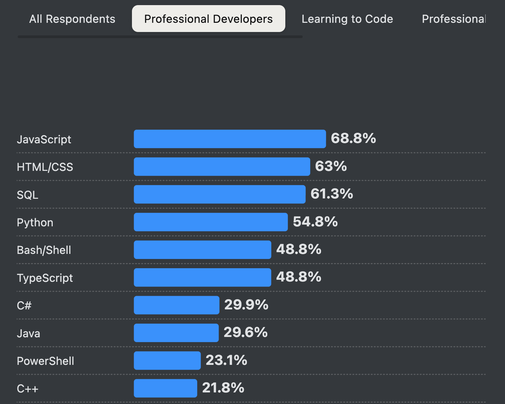

# Introduction

## Sommaire

<!--toc:start-->
- [Introduction](#introduction)
  - [Sommaire](#sommaire)
  - [Origine du langage](#origine-du-langage)
  - [Quelles utilisations ?](#quelles-utilisations)
<!--toc:end-->

## Origine du langage

- créé en 1989 par Guido Van Rossum
  - volonté d'écrire des scripts plus courts et plus lisibles (donc plus maintenable) par rapport à C++ ou Java
- dès sa conception, permettait d'écrire
  - des classes avec de l'héritage
  - des scripts typés
  - des gestions d'exception
  - des fonctions
- V1 en 1994
  - incorporation de méthodes fonctionnelles pour la manipulation de listes
  - est ajouté au CP4E pour rendre la programmation accessible au plus grand nombre
- V2 en 2000
  - ajout nouvelles méthodes fonctionnelles pour la compréhesion de listes (création de nouvelles listes à partir d'une existente)
  - unification des types et des classes en 2002 avec la V2.2 pour rendre le langage orienté objet
- V3 en 2008
  - restructuration du langage pour gagner en compréhension

Sources :

- [Wikipedia](https://en.wikipedia.org/wiki/History_of_Python)
- [GeeksforGeeks](https://www.geeksforgeeks.org/python/history-of-python/)

## Quelles utilisations ?

- utilisé par 55% des développeur.ses dans le monde
- utilisé par
  - Google
  - Reddit
  - Spotify
  - Instagram
  - Eve Online
- utilisé pour
  - développement de sites webs (avec Django et Flask)
  - datascience (avec Pandas, MatplotLib, NumPy)
  - machine learning (avec TensorFlow)
  - web scraping (avec BeautifulSoup et Scrapy)
  - développement de jeux vidéos (Pygame)
  
